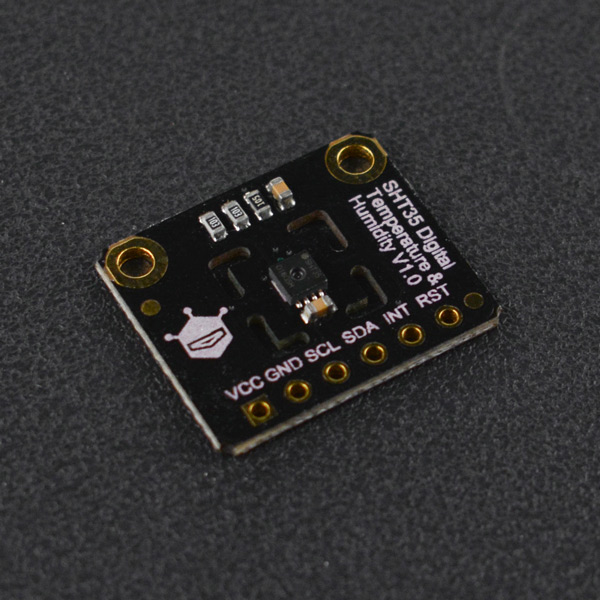

# DFRobot_MCP9808
- [中文版](./README_CN.md)

The MCP9808 is one of the more accurate temperature sensing options, with a typical accuracy of ±0.25°C and maximum accuracy of ±0.5°C over the sensor's -40°C to +125°C range and precision of +0.0625°C. The MCP9808 comes with user-programmable registers that allow user-selectable settings such as Shutdown or Low-Power modes and the specification of temperature Alert window limits and critical output limits. When the temperature changes beyond the specified boundary limits, the MCP9808 outputs an Alert signal. The user has the option of setting the Alert output signal polarity as an active-low or active-high comparator output for thermostat operation, or as a temperature Alert interrupt output for microprocessor-based systems. These features make the MCP9808 ideal for sophisticated, multi-zone, temperature-monitoring applications




## Product Link(https://www.dfrobot.com/product-2546.html)

    SKU:SEN0435

## Table of Contents

* [Summary](#Summary)
* [Installation](#Installation)
* [Methods](#Methods)
* [Compatibility](#Compatibility)
* [History](#History)
* [Credits](#Credits)

## Summary

- Operating Voltage : 2.7~5.5V<br>
- Operating Current : 200μA (typical)<br>
- Accuracy : ±0.25°C (typical) from -40°C to +125°C ±0.5°C (maximum) from -20°C to 100°C ±1°C (maximum) from -40°C to +125°C<br>
- User-Selectable Measurement Resolution : +0.5°C, +0.25°C, +0.125°C, +0.0625°C<br>
- User-Programmable Temperature Alert : Temperature Threshold Alert, Critical Temperature Alert<br>
- Communication Interface : I2C (2.54mm Breakout)<br>
- Dimension : 18.5×23mm/0.73×0.91"<br>
- Mounting Hole Size : 2mm<br>
- Mounting Hole Pitch : 18mm<br>

## Installation
Download the library file before use, paste it into the custom directory for Raspberry Pi, then open the examples folder and run the demo in the folder.

## Methods

```python
  '''!
    @brief Initialize sensor, comtrast sensor chip id with manufacturer id
    @return  int type
    @retval  0 is init success
    @retval -1 chip id or manufacturer id error, check please
  '''
  def sensor_init(self):

  '''!
    @brief Sensor sleep mode, lower power consumption, cannot read temp data at this time.
    @return int type 
    @retval 1, set successfully
    @retval 0, register lock is not allowed to be modified
  '''
  def sleep_mode(self):

  '''!
    @brief Sensor wake-up mode, temp data can be read at this time
    @return int type
    @retval 1, set successfully
    @retval 0, register lock is not allowed to be modified
  '''
  def wakeup_mode(self):

  '''!
    @brief Set power mode
    @n Wake-up mode: in this mode, the register can be accessed and the temp can be obtained normally；
    @n Sleep mode: temp measurement stop and the register can be read or written, but bus activity will cause higher power consumption.
    @param mode
    @n     POWER_UP_MODE         wake-up mode
    @n     LOW_POWER_MODE        sleep mode
    @return int type
    @retval 0 is set success
    @retval -1 The setting failed, the register is locked, please unlock it first.
  '''
  def set_power_mode(self ,mode):

  '''!
    @brief Get the configured power mode
    @n Wake-up mode: in this mode, the register can be accessed and the temp can be obtained normally；
    @n Sleep mode: temp measurement stop and the register can be read or written, but bus activity will cause higher power consumption
    @return int type
    @retval 0 is sleep mode
    @retval 1 is wakeup mode
  '''
  def get_power_mode(self):

  '''!
    @brief get device id
    @return device id (DEVICE_ID:0x04)
  '''
  def get_device_id(self):
  
  '''!
    @brief get manufacturer id
    @return manufacturer id (MANUFACTURER_ID:0x54)
  '''
  def get_manufacturer_id(self):
  
  '''!
    @brief Set resolution of the temperature sensor, the accuracy of the acquired temp is different in different resolution
    @param resolution
    @n     RESOLUTION_0_5     The decimal part of the obtained temp is a multiple of 0.5     e.g. 0.5°C, 1.0°C, 1.5°C
    @n     RESOLUTION_0_25    The decimal part of the obtained temp is a multiple of 0.25    e.g. 0.25°C, 0.50°C, 0.75°C
    @n     RESOLUTION_0_125   The decimal part of the obtained temp is a multiple of 0.125   e.g. 0.125°C, 0.250°C, 0.375°C
    @n     RESOLUTION_0_0625  The decimal part of the obtained temp is a multiple of 0.0625  e.g. 0.0625°C, 0.1250°C, 0.1875°C
    @return state
    @retval 0 is set successfully
    @retval -1 The set resolution error, check the resolution parameter.
  '''
  def set_resolution(self ,resolution):
    
  '''!
    @brief Get resolution of the temperature sensor, the accuracy of the acquired temp is different in different resolution.
    @return resolution 
    @retval RESOLUTION_0_5      The decimal part of the obtained temp is a multiple of 0.5     e.g. 0.5°C, 1.0°C, 1.5°C
    @retval RESOLUTION_0_25     The decimal part of the obtained temp is a multiple of 0.25    e.g. 0.25°C, 0.50°C, 0.75°C
    @retval RESOLUTION_0_125    The decimal part of the obtained temp is a multiple of 0.125   e.g. 0.125°C, 0.250°C, 0.375°C
    @retval RESOLUTION_0_0625   The decimal part of the obtained temp is a multiple of 0.0625  e.g. 0.0625°C, 0.1250°C, 0.1875°C
  '''
  def get_resolution(self):
  
  '''!
    @brief Get the current ambient temp, note that different temp accuracy can be obtained by setting different resolution, unit: ℃
    @return The temp value is a floating point (unit is ℃)
  '''
  def get_temperature(self):
  
  '''!
    @brief Get the current comparator status and temp data, which works only in comparator mode
    @return List for storing the current data
    @n      [0] The current temp
    @n      [1] Character string of the comparator status, compare the current temp with the upper threshold, lower threshold, and critical value
    @n      [2] Value of the comparator status, explained as follows
    @n      TA for current temp, TCRIT for critical temp, TUPPER for maximum temp, TLOWER for minimum temp
    @n      1 for TA ≥ TCRIT, TA > TUPPER, TA < TLOWER
    @n      0 for TA < TCRIT, TA ≤ TUPPER, TA ≥ TLOWER
    @n      ------------------------------------
    @n      | bit7 ~ bit3 | bit2 | bit1 | bit0 |
    @n      ------------------------------------
    @n      |  reserved   |  0   |  0   |  0   |
    @n      ------------------------------------
  '''
  def get_comparator_state(self):
    
  '''!
    @brief Set lock mode or unlock, prevent wrong operations that may change upper limit, lower limit and threshold value, 
    @n     and unlock only by power-off reset after locking
    @param lock
    @n     CRIT_LOCK       Lock threshold value, which is not allowed to be changed
    @n     WIN_LOCK        Lock upper and lower thresholds, which are not allowed to be changed
    @n     CRIT_WIN_LOCK   Lock threshold value, upper and lower limit, which are not allowed to be changed
    @n     NO_LOCK         No locking of register
    @return state
    @retval 0x00 is set successfully
    @retval 0xFE The set mode error
  '''
  def set_lock_state(self ,lock):
    
  '''!
    @brief Get locking status, to determine if upper limit, lower limit, and threshold can be changed
    @return state
    @retval CRIT_LOCK      Lock threshold value, which is not allowed to be changed
    @retval WIN_LOCK       Lock upper and lower thresholds, which are not allowed to be changed
    @retval CRIT_WIN_LOCK  Lock threshold and the window at the same time, upper limit, lower limit, and threshold are all not allowed to be changed
    @retval NO_LOCK        No locking, threshold value, upper and lower limit are all can be changed
  '''
  def get_lock_state(self):

  '''!
    @brief Set alert temp hysteresis range, add a range to the upper limit, lower limit and threshold, hysteresis function is only applicable to reduce temperature (from hot to cold)
    @n     i.e, ALE level will be restored only when the temp reaches the value obtained by subtracting hysteresis temp from the upper limit/lower limit/threshold.
    @n     For example: maximum temp is 30.0℃, hysteresis temp is +1.5℃, the current temp is 35℃ and ALE level has flipped,
    @n     and then the ALE level can only be restored when the temp goes to 30-1.5=28.5℃
    @param mode
    @n     HYSTERESIS_0_0     No hysteresis, respond when reaching the specified temp
    @n     HYSTERESIS_1_5     1.5℃ lag from hot to cold
    @n     HYSTERESIS_3_0     3.0℃ lag from hot to cold
    @n     HYSTERESIS_6_0     6.0℃ lag from hot to cold
    @return state
    @retval 0x00 is set successfully
    @retval -1 The current register is locked and not allowed to be changed
    @retval 0xFE The set resolution error, check the range.
  '''  
  def set_alert_hysteresis(self ,mode):
    
  '''!
    @brief Get hysteresis temp
    @return hysteresis
    @retval HYSTERESIS_0_0    No hysteresis, respond when reaching the specified temp
    @retval HYSTERESIS_1_5    1.5℃ lag from hot to cold
    @retval HYSTERESIS_3_0    3.0℃ lag from hot to cold
    @retval HYSTERESIS_6_0    6.0℃ lag from hot to cold
  '''
  def get_alert_hysteresis(self):
  
  '''!
    @brief Set pin ALE polarity, high polarity: pin ALE is active on high, the default is low level, which turns to high when alert occurs.
    @n     low polarity: pin ALE is active on low, the default is high level, which turns to low when alert occurs.
    @param polarity
    @n     POLARITY_HIGH   pin ALE is active on high
    @n     POLARITY_LOW    pin ALE is active on low
    @return state
    @retval 0x00 is set successfully
    @retval -1   The current register is locked and not allowed to be changed.
    @retval 0xFE The set polarity error, check the polarity.
  '''
  def set_polarity(self ,polarity):
    
  '''!
    @brief Get pin ALE polarity, high polarity: pin ALE is active on high, the default is low level, which turns to high when alert occurs.
    @n     low polarity: pin ALE is active on low, the default is high level, which turns to low when alert occurs.
    @return polarity
    @retval POLARITY_HIGH   pin ALE is active on high
    @retval POLARITY_LOW    pin ALE is active on low
  '''
  def get_polarity_state(self):
    
  '''!
    @brief Set alert output mode, clearing interrupt is not required in comparator output mode, but required in interrupt mode
    @param mode
    @n     COMPARATOR_OUTPUT_MODE           clearing interrupt is not required in comparator output mode, 
    @n      For example: set pin ALE to be active on low, when the temp exceeds the upper limit alert temp, pin ALE level turns from high to low; when it's below the upper but above the lower limit, pin ALE level turns back to high
    @n     INTERRPUT_OUTPUT_MODE            clearing interrupt is required in interrupt mode, when an alert occurs, the interrupt keep existing if it's not cleared, triggering interrupt mode means status changes from one to another 
    @n      For example, set lower threshold to be 20℃, upper threshold 25℃, and threshold 30℃, no interrupt occurs when temp is below 20℃; when temp exceeds 25℃, interrupt occurs and pin ALE jump, the interrupt should be cleared at the time and pin ALE is restored; 
    @n      in the special case, when the current temp is above the critical temp of 30℃, the interrupt mode and clearing interrupt are both invalid, the interrupt mode will be restored only when the temp drops below 30℃.
    @n     DISABLE_OUTPUT_MODE              After disabling output mode, no alert occurs and pin ALE is invalid.
    @return state
    @retval 0x00 is set successfully
    @retval -1 The current register is locked and not allowed to be changed
    @retval 0xFE The set alert output mode error, check the mode.
  '''
  def set_alert_output_mode(self ,mode):
  
  '''!
    @brief Get alert output mode
    @return mode
    @retval COMPARATOR_OUTPUT_MODE     Comparator output mode
    @retval INTERRPUT_OUTPUT_MODE      Interrupt output mode
    @retval DISABLE_OUTPUT_MODE        Disable output mode
  '''
  def get_alert_output_mode(self):
  
  '''!
    @brief Enable or disable alert mode, after enabling it, pin ALE will jump when satisfying the alert condition; if disabling it, pin ALE has no response
    @param mode
    @n     ENABLE_ALERT      after enabling alert mode, pin ALE will jump when satisfying the alert condition
    @n     DISABLE_ALERT     when disabling alert mode, pin ALE has no response
    @return state
    @retval 0x00 is set successfully
    @retval -1   The current register is locked and not allowed to be changed
    @retval 0xFE The set mode error, check the mode.
  '''
  def set_alert_enable(self ,mode):
    
  
  '''!
    @brief Get the alert mode status, enable alert mode or disable it
    @return mode
    @retval ENABLE_ALERT  enable alert mode
    @retval DISABLE_ALERT disable alert mode
  '''
  def get_alert_enable_state(self):
  
  '''!
    @brief Set alert response mode, respond to upper & lower limits and threshold; or only respond to threshold, which is inapplicable to interrupt mode
    @param mode
    @n     UPPER_LOWER_CRIT_RESPONSE       enable upper/lower limits and threshold response,
    @n     ONLY_CRIT_RESPONSE              disable upper/lower limits response, only enable threshold response
    @return state
    @retval 0x00 is set successfully
    @retval -1   The current register is locked and not allowed to be changed
    @retval 0xFE The set response mode error, check the mode.
  '''
  def set_alert_response_mode(self ,mode):
  
  '''!
    @brief Get response mode
    @return mode
    @retval UPPER_LOWER_CRIT_RESPONSE    enable upper/lower limits and threshold response
    @retval ONLY_CRIT_RESPONSE           disable upper/lower limits response, only enable threshold response
  '''
  def get_alert_response_mode(self):

  '''!
    @brief Set threshold value, the upper and lower thresholds, and respond according to the configured interrupt mode 
    @n     Responding interrupt when the temp is above the upper limit, below the lower limit and above the threshold
    @n     the critical temp must be above the upper limit
    @n     The upper limit temp must be 2℃ higher than the lower limit temp
    @param crit  Temp threshold, up to two decimal places, automatically processed to multiples of 0.25, range is from -40 to +125℃
    @param upper Upper limit temp, up to two decimal places, automatically processed to multiples of 0.25, range is from -40 to +125℃
    @param lower Lower limit temp, up to two decimal places, automatically processed to multiples of 0.25, range is from -40 to +125℃
    @return state
    @retval 0  is set successfully
    @retval -3 The critical temp is below the upper limit
    @retval -2 Upper limit temp is below lower limit, or (upper limit temp - lower limit temp < 2)
    @retval -1 The register is locked and can't be changed.
  '''
  def set_threshold(self, crit, upper, lower):
    
  '''!
    @brief Clear interrupt, only used in interrupt mode, not work in other modes
  '''
  def clear_interrupt(self):
 
```

## Compatibility

* RaspberryPi Version

| Board        | Work Well | Work Wrong | Untested | Remarks |
| ------------ | :-------: | :--------: | :------: | ------- |
| RaspberryPi2 |           |            |    √     |         |
| RaspberryPi3 |     √     |            |          |         |
| RaspberryPi4 |           |            |    √     |         |

* Python Version

| Python  | Work Well | Work Wrong | Untested | Remarks |
| ------- | :-------: | :--------: | :------: | ------- |
| Python2 |     √     |            |          |         |
| Python3 |     √     |            |          |         |


## History

- 2021/04/16 - V1.0.0 Version

## Credits

Written by ZhixinLiu(zhixin.liu@dfrobot.com), 2021. (Welcome to our [website](https://www.dfrobot.com/))
